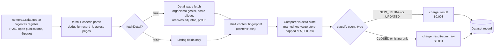

<div align="center">

# Salta Argentina Contrataciones - Tender Delta API

*A delta-tracked monitor for Salta Province's public procurement portal — new, amended and closed tenders delivered as a dataset, not a page you have to keep re-checking.*

[](https://apify.com)
[](https://apify.com/stefano_seggio/salta-compras-monitor)
[](https://www.typescriptlang.org/)
[](LICENSE)

[](https://apify.com/stefano_seggio/salta-compras-monitor)

Owner console reference: [console.apify.com/actors/Tx9wBKZyySZa5WcsE](https://console.apify.com/actors/Tx9wBKZyySZa5WcsE)

</div>

**This Actor monitors Salta Province, Argentina's official public-procurement portal and delivers new, amended and closed tenders as a delta feed, on whatever recurring schedule you configure through Apify's own Scheduler.**

## What this monitors

[`compras.salta.gob.ar`](https://compras.salta.gob.ar) is the Province of Salta, Argentina's official portal for public procurement (**compras públicas**) — every currently open (*vigente*) **licitación pública**, **contratación abreviada** and **adjudicación simple** the province's organisms are running. Checking it by hand means paging through the open register five records at a time, opening each publication's detail page for the organism, expediente and attached documents, and remembering what you saw last time to tell what actually changed. There is no RSS feed, no change log, and no API — just a paginated HTML register that silently reflects a new amount, a corrected opening date, or a publication that quietly disappears once it closes.

This Actor automates that loop. It walks the full open register, fingerprints every publication's content, and returns a dataset that already tells you what is **new**, **amended** or **closed** since your last run — scoped to exactly what the source publishes, nothing broader.

Point it at a daily schedule and the manual page-by-page check for Salta government tenders and public procurement becomes a dataset diff you can wire into Slack, a spreadsheet, or your own pipeline.

## Who uses this

- **Suppliers bidding into Salta provincial organisms** (construction, health equipment, IT, general services). Filter by organism and subject to find `Adjudicación Simple`, `Contratación Abreviada` or `Licitación Pública` processes that match what you sell, and watch for an `UPDATED` event on a tracked record to catch a changed amount, a newly attached document, or a corrected opening date before the deadline passes.
- **Bid consultants and gestores tracking several clients' tenders at once.** Run with `onlyNew: true` and get back only the publications that are new, changed or closed since the last run, with a direct link to the official page for each — no need to re-read the whole portal to see what moved.
- **Transparency researchers and journalists.** Because every record carries the publication type and buying organism, a dataset built up over scheduled runs lets you tally how often a given hospital or ministry issues lower-competition awards versus competitive calls — a pattern that's tedious to compile by re-visiting the portal case by case.

## How it works



## Features

| Feature | What it does |
| --- | --- |
| **Delta mode** (`onlyNew`) | Returns only publications that are new, changed or closed since a previous run; state persists in a named key-value store dedicated to this Actor so it survives between scheduled runs. |
| **Amendment detection** | Every publication is sha1-fingerprinted (`contentHash`) over its listing and detail fields, so a changed amount, a newly attached document, or a corrected opening date is reported as `UPDATED` instead of silently overwriting what a previous run saw. |
| **Closure inference** | A previously-seen `record_id` absent from a *complete* walk is reported as `CLOSED` — the open register has no closed/withdrawn signal, a publication just disappears. |
| **Event-type filter** (`eventTypes`) | Narrows delta-mode delivery to any subset of `NEW_LISTING`, `UPDATED`, `CLOSED`. |
| **Opening-window filter** (`dateRange`) | Filters to publications whose bid-opening deadline (`fechaApertura`/`horaApertura`) falls in the next 24h, 7d or 30d — the only date field this source exposes. |
| **Full detail fetch** (`fetchDetail`) | Pulls organismo gestor, costo pliego, lugar de entrega and attached-document links (PDFs, spreadsheets) per publication, on top of the listing fields. |
| **Pagination-safe extraction** | Deduplicates publications that the portal's own pagination repeats across adjacent pages, with 4 retries and exponential backoff (1s/2s/4s/8s) on every request. |
| **Run cap** (`maxItems`) | Hard limit on publications returned per run, sized against the register's own ~250-publication scale. |

## Cost & BYOK Disclosure

| Event | Price | Charged when |
| --- | --- | --- |
| `result` | $0.003 / record | A record with fresh detail fetched this run — new or amended, `fetchDetail: true` |
| `result-summary` | $0.001 / record | A listing-only record (`fetchDetail: false`), or a `CLOSED` record — there's nothing left to re-fetch |

- **No third-party API key required.** This Actor's `byok` status is `none` — everything it needs to run is included; there is no external service key to obtain, configure, or pay for separately.
- **Unchanged records are never billed.** Every publication is sha1-fingerprinted (`contentHash`) and compared against the fingerprint persisted from this Actor's own last run. In delta mode (`onlyNew: true`), a publication whose fingerprint still matches is not new, amended or closed — it is simply not returned, and not charged.
- Platform usage is included in both prices — there is no separate compute charge. A daily monitor of the roughly 250-publication register that finds 5 changes costs about $0.02/day (~$0.60/month); a one-off full pull with detail across the whole register costs about $0.75.

## Quickstart

Get an API token from [console.apify.com/settings/integrations](https://console.apify.com/settings/integrations) (or run `apify login` with the Apify CLI). All three examples below call the real Actor at `stefano_seggio/salta-compras-monitor`.

### cURL

Runs synchronously and returns the resulting dataset items directly in the response — no polling needed.

```bash
curl -X POST "https://api.apify.com/v2/acts/stefano_seggio~salta-compras-monitor/run-sync-get-dataset-items?token=<YOUR_API_TOKEN>" \
  -H "Content-Type: application/json" \
  -d '{
  "maxItems": 50,
  "onlyNew": true
}'
```

### Python (`apify_client`)

```python
from apify_client import ApifyClient

client = ApifyClient("<YOUR_API_TOKEN>")

run = client.actor("stefano_seggio/salta-compras-monitor").call(run_input={
    "fetchDetail": True,
    "maxItems": 100,
    "onlyNew": True,
    "eventTypes": ["NEW_LISTING", "UPDATED", "CLOSED"],
    "dateRange": "7d",
})

for item in client.dataset(run["defaultDatasetId"]).iterate_items():
    print(item["event_type"], item["titulo"], item["organismo"])
```

### Node.js (`apify-client`)

```javascript
import { ApifyClient } from 'apify-client';

const client = new ApifyClient({ token: process.env.APIFY_TOKEN });

const run = await client.actor('stefano_seggio/salta-compras-monitor').call({
  fetchDetail: true,
  maxItems: 100,
  onlyNew: true,
  eventTypes: ['NEW_LISTING', 'UPDATED', 'CLOSED'],
  dateRange: '7d',
});

const { items } = await client.dataset(run.defaultDatasetId).listItems();
for (const item of items) {
  console.log(item.event_type, item.titulo, item.organismo);
}
```

For a faster, listing-only census of the whole register instead of a recurring delta check, run with `{ "fetchDetail": false, "maxItems": 300 }`. You can also run it from the CLI (`apify call salta-compras-monitor --input '{...}'`) or from the **Run on Apify Store** button above.

## Use this from Claude Desktop, Cursor, or Windsurf (via MCP)

This Actor is also reachable as an MCP tool through Apify's own hosted `@apify/actors-mcp-server`, scoped to just this one Actor via a `?tools=` query string — not the full fleet. Get a token from [Apify Console → Settings → Integrations](https://console.apify.com/settings/integrations) first.

**Claude Desktop** (`%APPDATA%\Claude\claude_desktop_config.json` on Windows, `~/Library/Application Support/Claude/claude_desktop_config.json` on macOS) — uses the `mcp-remote` stdio bridge. Note: `mcp-remote` does not expand shell environment variables inside the JSON string, so paste the literal token in place of `${APIFY_TOKEN}` below, and keep this file out of version control.

```json
{
  "mcpServers": {
    "delta-registry-salta-compras-monitor": {
      "command": "npx",
      "args": [
        "-y",
        "mcp-remote",
        "https://mcp.apify.com/?tools=stefano_seggio/salta-compras-monitor",
        "--header",
        "Authorization: Bearer ${APIFY_TOKEN}"
      ]
    }
  }
}
```

**Cursor** (`.cursor/mcp.json` or `~/.cursor/mcp.json`) — native HTTP transport:

```json
{
  "mcpServers": {
    "delta-registry-salta-compras-monitor": {
      "url": "https://mcp.apify.com/?tools=stefano_seggio/salta-compras-monitor",
      "headers": {
        "Authorization": "Bearer ${APIFY_TOKEN}"
      }
    }
  }
}
```

**Windsurf** (`~/.codeium/windsurf/mcp_config.json`) — uses `serverUrl`, not `url`. Windsurf's `${env:...}` syntax genuinely does resolve from the environment, unlike Claude Desktop's config above:

```json
{
  "mcpServers": {
    "delta-registry-salta-compras-monitor": {
      "serverUrl": "https://mcp.apify.com/?tools=stefano_seggio/salta-compras-monitor",
      "headers": {
        "Authorization": "Bearer ${env:APIFY_TOKEN}"
      }
    }
  }
}
```

Want the full 28-actor fleet in one closed-scope config instead of just this Actor? See [`MCP_INTEGRATION.md`](https://github.com/stefanoseggio/delta-registry-website/blob/main/MCP_INTEGRATION.md) in the `delta-registry-website` repo.

## Input & Output Schema

### Input

| Field | Type | Default | Description |
| --- | --- | --- | --- |
| `fetchDetail` | boolean | `true` | Fetch each publication's detail page for the full field set plus attached-document links. Disable for a faster, listing-only run. |
| `maxItems` | integer | `100` | Hard cap on publications returned this run. |
| `onlyNew` | boolean | `false` | Delta mode: returns only publications that are new, changed or closed since a previous run. |
| `eventTypes` | array | all three | Which of `NEW_LISTING` / `UPDATED` / `CLOSED` to deliver when `onlyNew` is on. |
| `dateRange` | enum | *(none)* | `"24h"`, `"7d"` or `"30d"` — filters to publications opening within that window. |

See [`.actor/input_schema.json`](.actor/input_schema.json) for the full, authoritative schema.

### Output

One dataset record per publication, combining the source's listing and detail-page fields with a change-tracking envelope (real field values, from a publication fetched during development):

```json
{
  "record_id": "148204",
  "titulo": "Adjudicación Simple N° 98/2026",
  "tipoPublicacion": "Adjudicación Simple",
  "fechaApertura": "07/09/2026",
  "horaApertura": "09:00",
  "objeto": "ADQ. DE UN MOTOR TRIFASICO. PROGRAMA DE FISCALIZACION Y CONTROL",
  "organismo": "Hospital Señor del Milagro",
  "expediente": "0100134-173362/2026-0",
  "event_type": "NEW_LISTING",
  "is_new": true,
  "contentHash": "6cffa4c6c4f40d13d460fbee614a93deea4214eb",
  "source_url": "https://compras.salta.gob.ar/publico/publicacionactual/verpublicacion1/148204/0",
  "scraped_at": "2026-09-04T21:19:40.875Z"
}
```

| Field | Type | Description |
| --- | --- | --- |
| `record_id` | string | The portal's own numeric id for this publication. |
| `titulo` | string | Publication title, e.g. "Adjudicación Simple N° 98/2026". |
| `tipoPublicacion` | string | Procedure type: `Licitación Pública`, `Contratación Abreviada`, or `Adjudicación Simple`. |
| `numeroPublicacion` | string | Publication number as shown by the portal (the "N°" portion of `titulo`), e.g. "98/2026". |
| `fechaApertura` / `horaApertura` | string | Bid-opening date/time — the only date field this source exposes anywhere. |
| `objeto` | string | Free-text subject/object of the procurement. |
| `organismo` | string | Buying organism (hospital, ministry, etc.). |
| `expediente` | string | Official expediente (case file) number. |
| `consultaPliego` | string | "Consulta y Adquisición de Pliego" field — where/how to obtain the tender documents, as published by the portal. |
| `consultas` | string | "Consultas" field — contact/inquiry information published for the tender. |
| `event_type` | string | `NEW_LISTING`, `UPDATED`, or `CLOSED` since the last run. |
| `is_new` | boolean | Whether `record_id` had never been seen before this run. |
| `contentHash` | string | SHA-1 fingerprint of the publication's tracked fields, used to detect `UPDATED` across runs. |
| `source_url` | string | Direct link to the publication's page on `compras.salta.gob.ar`. |
| `scraped_at` | string (ISO 8601) | When this run fetched the record. |

When `fetchDetail: true`, each record also carries a `detail` object with `fields` (organismo gestor, costo pliego, lugar de entrega, when present), `pdfUrl`, and `archivosAdjuntos` — the publication's uploaded PDF/spreadsheet attachments. See [`.actor/dataset_schema.json`](.actor/dataset_schema.json) for the full shape, and the Actor's two ready-made dataset views (**Overview**, **Status changes & amendments**) on the Apify platform.

## Reliability

- **No proxy, no browser.** The source is server-rendered HTML with the tender data already present in the initial response, so a plain fetch + cheerio parse reaches it from a standard datacenter IP.
- **Retries with backoff.** Every request retries up to 4 times with exponential backoff (1s, 2s, 4s, 8s) before the run gives up, isolating transient network failures from real extraction issues.
- **Pagination deduplicated by id.** The portal's own pagination can return the same publication on two adjacent pages once several records share the same opening date/time; the walk tracks seen ids in-run and drops repeats before they reach the dataset.
- **Delta state persisted safely.** Seen-publication state lives in a named key-value store dedicated to this Actor, which survives between scheduled runs, and is capped at the 5,000 most recently numbered ids so it doesn't grow unbounded.

## Why not just scrape it yourself

- **Zero infrastructure.** No server or cron box to provision and keep alive — the Actor runs on Apify's platform and can be scheduled from the Apify Scheduler in a couple of clicks.
- **Nothing to babysit.** Pagination is walked and deduplicated by id automatically, and every request already retries with exponential backoff before the run gives up on a transient failure.
- **Built-in delta and change detection.** The sha1 content-fingerprinting and cross-run delta state (new / amended / closed) are already built and tested — you'd otherwise have to design and persist that comparison logic yourself.
- **Managed scheduling and structured output.** Runs land in a dataset with two ready-made views instead of raw HTML you'd have to parse into your own database before you could query it.

## Contributing & Local Setup

This repository contains the Actor's real, buildable TypeScript source under `src/` — cloning it gets you the actual crawler, delta-engine and fingerprinting logic, not just documentation:

```bash
git clone https://github.com/stefanoseggio/salta-compras-monitor.git
cd salta-compras-monitor
npm install
apify login    # one-time; stores your Apify token locally
apify run --purge --input '{"maxItems":20,"fetchDetail":false}'
```

Before opening a pull request, run this repo's own checks, in order:

```bash
npm run build   # tsc — catches type errors
npm run lint    # ESLint (@apify/eslint-config)
npm test        # Vitest unit tests
```

Then inspect `storage/datasets/default/*.json` from a local `apify run`, not just the log tail. `storage/` is local-only and is never synced to Apify Console; confirming real cloud behavior (delta state persistence across separate runs, proxy/session behavior, scheduling) requires `apify push` to a build tag and a real run on the platform. Bug reports and feature requests are welcome via the Issues tab on this repo or on the Apify Store listing — typically triaged within about 48 hours.

## Known limitations

- `dateRange` filters by each publication's bid-opening deadline (`fechaApertura`/`horaApertura`) — the only date field the source exposes anywhere. For the currently-open register, that date is almost always in the future, so this reads as "opens within the next N," not "published in the last N."
- `CLOSED` detection requires a *complete* walk of the register. If `maxItems` truncates it, closure detection is skipped for that run (and logged) rather than guessed from a partial census.
- Delta state is capped at the 5,000 most recently numbered ids so it doesn't grow unbounded — it is not an unlimited historical archive of every publication ever seen.
- This is an independently developed and maintained Actor, not a managed enterprise product — there is no contractual uptime SLA. Issues are typically triaged within about 48 hours via the Actor's issue tracker on the Apify Store.

---

<div align="center">

### About Delta Registry

This Actor is part of **Delta Registry** — pay-per-event regulatory and compliance data infrastructure, turning government portals that offer no API into structured, delta-tracked datasets. For professional inquiries or enterprise licensing, reach out on [LinkedIn](https://www.linkedin.com/in/stefanoseggio-deltaregistry); for the rest of the fleet, see [github.com/stefanoseggio](https://github.com/stefanoseggio).

</div>
